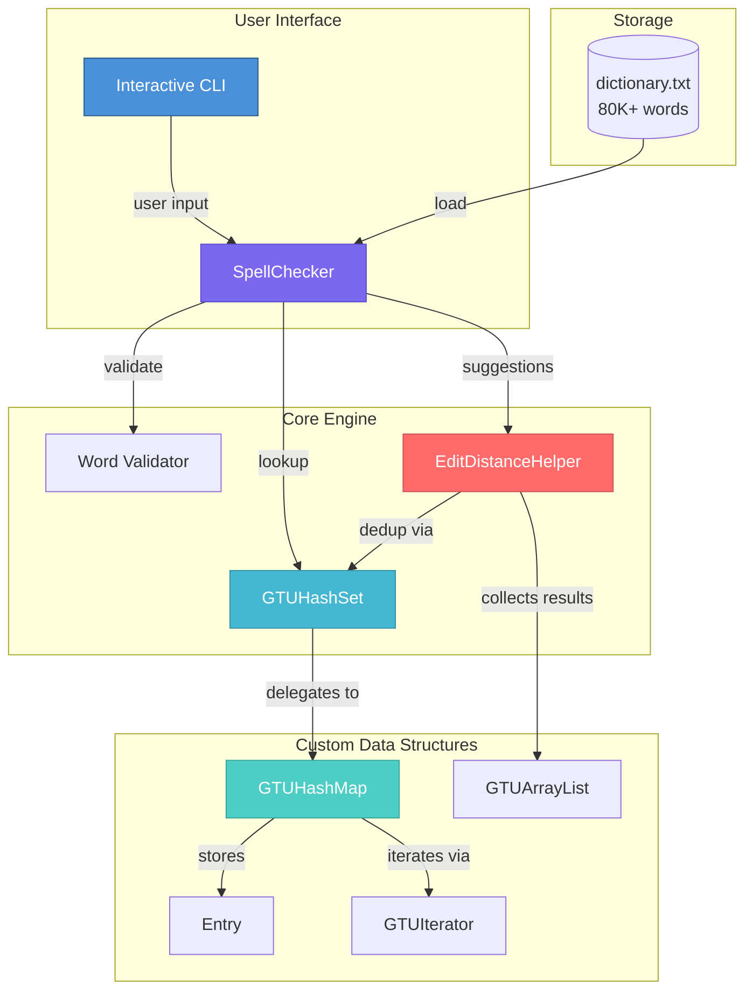
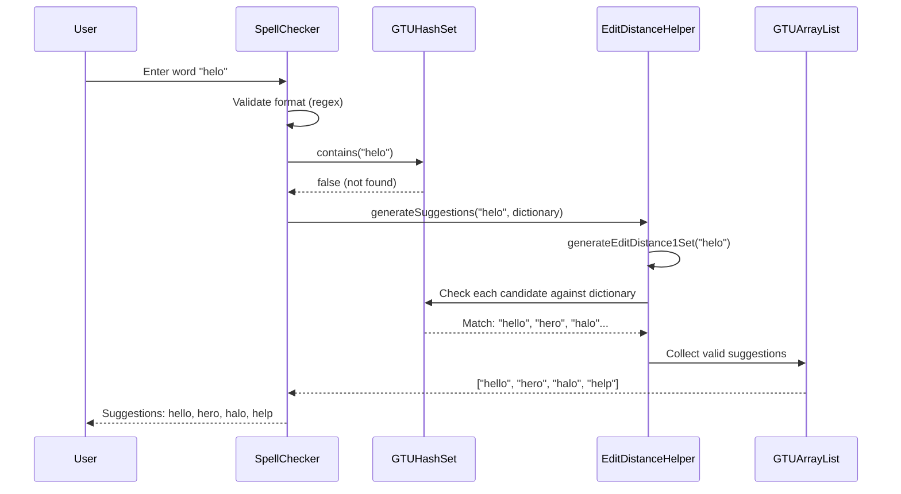
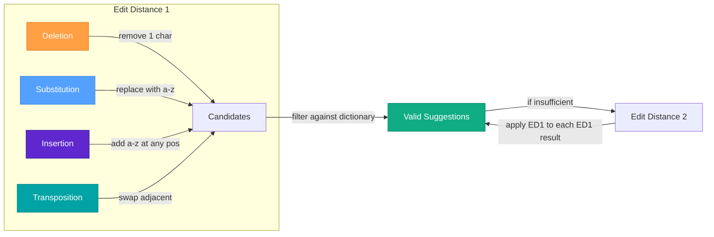

<p align="center">
  
  
  
  
</p>

# 🔍 High-Performance Spell Checker

> A high-performance spell checking engine built from scratch in Java — featuring custom hash-based data structures, edit distance algorithms, and JIT-optimized lookups with sub-millisecond response times.

**No external libraries. No Java Collections Framework. Pure algorithmic implementation.**

---

## 📋 Table of Contents

- [Highlights](#-highlights)
- [Architecture](#-architecture)
- [Data Structures](#-custom-data-structures)
- [Algorithms](#-algorithms)
- [Performance](#-performance-analysis)
- [Getting Started](#-getting-started)
- [Usage](#-usage)
- [Project Structure](#-project-structure)
- [Technical Deep Dive](#-technical-deep-dive)
- [License](#-license)

---

## ⚡ Highlights

| Feature | Description |
|---------|-------------|
| 🏗️ **Custom Data Structures** | HashMap, HashSet, ArrayList — all implemented from scratch |
| 🔢 **Quadratic Probing** | Collision resolution with prime-capacity tables for optimal distribution |
| 📏 **Edit Distance 1 & 2** | Deletion, substitution, insertion, and transposition operations |
| ⚙️ **JIT Warm-up** | Pre-optimization phase for consistent sub-millisecond lookups |
| 📊 **Real-time Metrics** | Collision count, memory usage, and lookup time tracking |
| 🔤 **Special Character Support** | Handles `@`, `.`, `-`, `!`, `?`, `+` in word validation |

---

## 🏛️ Architecture



### Data Flow — Spell Check Query



---

## 🧱 Custom Data Structures

All data structures are implemented **from scratch** without using `java.util` collections.

### GTUHashMap\<K, V\>

| Property | Detail |
|----------|--------|
| **Collision Resolution** | Quadratic probing (`k += 2` increment) |
| **Hash Function** | Bit-manipulation with prime multiplier (`0x45d9f3b`) |
| **Load Factor** | 0.5 (rehash when exceeded) |
| **Table Sizing** | Always prime numbers for uniform distribution |
| **Deletion** | Lazy deletion (tombstone markers) |

#### Algorithmic Complexity

| Operation | Average | Worst Case |
|-----------|---------|------------|
| `put(K, V)` | O(1) | O(n) |
| `get(K)` | O(1) | O(n) |
| `remove(K)` | O(1) | O(n) |
| `containsKey(K)` | O(1) | O(n) |
| `rehash()` | O(n) | O(n) |

### GTUHashSet\<E\>

- Wrapper around `GTUHashMap<E, Object>` using sentinel values
- Provides `add`, `remove`, `contains` with O(1) average-case performance

### GTUArrayList\<E\>

- Dynamic array with 2x growth factor
- Supports `add`, `get`, `remove`, `clear`
- Uses `System.arraycopy` for efficient element shifting

### GTUIterator\<T\>

- Custom iterator interface with `hasNext()` / `next()`
- Supports lazy traversal of hash map entries (skips tombstones)

---

## 🧮 Algorithms

### Hash Function

A high-quality hash function using bit mixing to minimize clustering:

```java
private int hash(K key) {
    int h = key.hashCode();
    h ^= (h >>> 16);        // Mix high bits into low bits
    h *= 0x45d9f3b;         // Multiply by a large prime
    h ^= (h >>> 16);        // Mix again for avalanche effect
    return (h & 0x7fffffff) % capacity;
}
```

### Edit Distance Operations

The spell checker generates candidates using four edit operations:



| Operation | Description | Candidates Generated |
|-----------|-------------|---------------------|
| **Deletion** | Remove one character at each position | `n` |
| **Substitution** | Replace each char with 25 alternatives | `25n` |
| **Insertion** | Insert a-z at each position | `26(n+1)` |
| **Transposition** | Swap adjacent characters (≤6 chars) | `n-1` |

**Total ED1 candidates ≈ `52n + 26`** for a word of length `n`.

---

## 📊 Performance Analysis

### Theoretical Complexity

| Component | Operation | Time Complexity | Space Complexity |
|-----------|-----------|----------------|-----------------|
| Dictionary Load | Insert all words | O(n) amortized | O(n) |
| Word Lookup | Single hash check | O(1) average | O(1) |
| ED1 Generation | All single edits | O(n) per word | O(n) |
| ED2 Generation | ED1 on each ED1 result | O(n²) per word | O(n²) |
| Suggestion Filtering | Dictionary membership | O(k) for k candidates | O(k) |

### Optimization Techniques

| Technique | Purpose | Impact |
|-----------|---------|--------|
| **JIT Warm-up** | Pre-run 20 lookups + suggestions | Consistent sub-ms response |
| **Prime Capacities** | Table sizes are always prime | Better hash distribution |
| **0.5 Load Factor** | Aggressive rehashing threshold | Fewer collisions |
| **Lazy Deletion** | Tombstone markers instead of shifting | O(1) delete operations |
| **StringBuilder** | Efficient string manipulation | Reduced GC pressure |
| **Early Termination** | Stop at 10,000 suggestions | Bounded response time |

---

## 🚀 Getting Started

### Prerequisites

- **Java Development Kit (JDK)** 8 or higher
- **GNU Make** (optional, for build automation)

### Build & Run

```bash
# Clone the repository
git clone https://github.com/zehragzl/High-Performance-Spell-Checker.git
cd High-Performance-Spell-Checker

# Build the project
make build

# Run the spell checker
make run

# Generate Javadoc documentation
make doc

# Run performance benchmark
make benchmark

# Clean build artifacts
make clean
```

### Manual Build (without Make)

```bash
# Compile
find src -name "*.java" > sources.txt
javac -d build @sources.txt

# Run spell checker
java -cp build SpellChecker.SpellChecker

# Run benchmark
java -cp build SpellChecker.SpellCheckerBenchmark
```

---

## 💻 Usage

### Interactive Mode

```
$ make run

Total collisions during dictionary load: 1,247
Approximate memory used: 45.67 MB

Enter a word (or type 'exitprogram' to quit): hello
Correct.
Lookup and suggestion took 0.12 ms

Enter a word (or type 'exitprogram' to quit): helo
Incorrect.
Suggestions: hello, helot, halo, hero, help, held, helm, heap
Lookup and suggestion took 2.34 ms

Enter a word (or type 'exitprogram' to quit): exitprogram
Exiting SpellChecker. Goodbye!
```

### Benchmark Mode

```
$ make benchmark

=== High-Performance Spell Checker — Benchmark ===
Dictionary Load Time:       234.56 ms
Total Collisions:           1,247
Dictionary Size:            80,123 words
Memory Used:                45.67 MB
Avg Lookup (correct word):  0.08 ms
Avg Lookup (misspelled):    1.92 ms
ED1 Generation Time:        0.45 ms
ED2 Generation Time:        12.30 ms
```

---

## 📁 Project Structure

```
High-Performance-Spell-Checker/
├── src/
│   ├── DataStructures/
│   │   ├── Entry.java              # Key-value pair with tombstone support
│   │   ├── GTUArrayList.java       # Dynamic array implementation
│   │   ├── GTUHashMap.java         # Hash table with quadratic probing
│   │   ├── GTUHashSet.java         # Set built on GTUHashMap
│   │   └── GTUIterator.java        # Custom iterator interface
│   └── SpellChecker/
│       ├── EditDistanceHelper.java # Edit distance 1 & 2 generation
│       ├── SpellChecker.java       # Main application & CLI
│       └── SpellCheckerBenchmark.java # Performance benchmark suite
├── dictionary.txt                  # 80K+ English word dictionary
├── makefile                        # Build automation (build/run/test/doc)
├── LICENSE                         # MIT License
├── CONTRIBUTING.md                 # Contribution guidelines
├── .gitignore                      # Git ignore rules
└── README.md                       # This file
```

---

## 🔬 Technical Deep Dive

### Why Quadratic Probing?

Linear probing suffers from **primary clustering** — consecutive occupied slots form long chains, degrading lookup performance. Quadratic probing mitigates this by using a non-linear probe sequence:

```
index = (hash + 1² + 3² + 5² + ...) % capacity
```

Combined with **prime-sized tables**, this guarantees that all table positions are reachable before any position is revisited.

### Why 0.5 Load Factor?

A lower load factor trades memory for speed. At 0.5, the expected number of probes for a successful lookup is approximately **1.5**, compared to ~2.5 at load factor 0.75. For a spell checker where lookup speed is critical, this is an optimal trade-off.

### Edit Distance Strategy

Instead of computing the traditional Levenshtein distance matrix (O(m×n) per word pair), the system **generates** all possible single-edit variants and checks them against the dictionary. This approach is faster for spell checking because:

1. Dictionary lookup is O(1) with hash tables
2. Only ~52n candidates are generated per word
3. Invalid candidates are rejected immediately without full distance computation

---

## 📄 License

This project is licensed under the MIT License — see the [LICENSE](LICENSE) file for details.

## 👤 Author

**Zehra Güzel**

- GitHub: [@zehragzl](https://github.com/zehragzl)

## 🙏 Acknowledgments

- Dictionary source: Standard English word list
- Algorithm references: Edit distance and hash table literature
